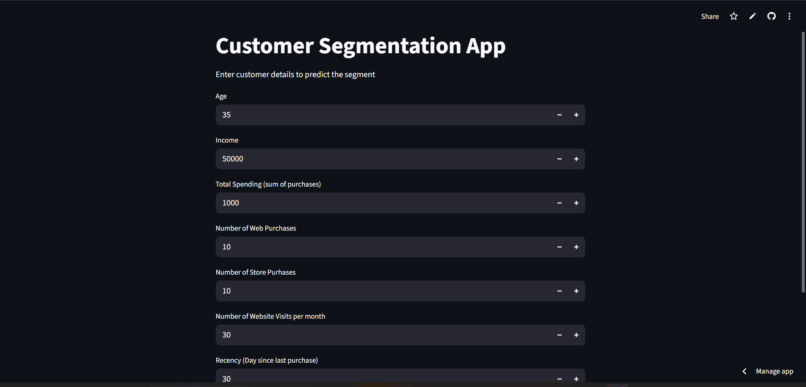

# Customer Segmentation with K-Means Clustering in Python

## Executive Summary

### Problem:
- The company lacked knowledge of customer behavior, which led to ineffective mass-marketing campaigns.

### Solution:
Used **K-Means Clustering** to classify customers into precise groups through demographics, spend, and engagement parameters.

### Outcome:
Enabled **effective marketing** and enhanced resource utilization, improving the ability to personalize campaigns and increase ROI.

customer segmentation can typically lead to:

- 20–30% improved ROI on advertising efforts through targeting
- 10–20% increase in customer interaction and retention
- Reduction in marketing expense through prevention of irrelevant campaigns

## Business Problem

- Marketing campaigns were mass and generic rather than customer behavior-centered. The goal was to identify key groups of customers in order to:
- Improve targeting
- Reduce wastage in marketing
- Maximize campaign effectiveness

## Methodology

### Data Preprocessing

- Handled missing values, cleaned data, and discarded irrelevant features
- A transformer applied to categorical features, and a scaler is applied to numerical features.
  
### Feature Engineering
- Generated new features (e.g., total children, sum of spends)

### Clustering
- Applied K-Means after dimensionality reduction by PCA
- Applied the Elbow Method for identifying the optimal number of clusters

### Visualization
- Built an interactive dashboard using Streamlit to analyze customer segments

### Skills & Tools Used

- Python (Pandas, NumPy, Scikit-learn, Matplotlib, Seaborn, Plotly)
- Machine Learning: K-Means, PCA
-Streamlit (dashboard)
-Data Cleaning & Feature Engineering

## Results
### Identified 3-5 distinct customer segments, such as:
- cluster 4 (Age 46+) - highest income earners and the highest spenders
- cluster 2 (Age 69+) - oldest cluster group, second highest income earners, second highest spenders
- cluster 3 (Age 50+) - lowest income earners, lowest spenders
- cluster 1 (Age 55+) - High recency - Most recent customers
- cluster 0 (Age 58+) - most likely people to buy from the company's websites, mostlikely people to buy from the store
- cluster 5 (62+) - lowest recency- dormant Customers
 
  
[Customer Segmentation](customer_segmentation_pic.png)

### Delivered a Streamlit app for business users to:
- Inspect and filter customer groups.
- Visualize key metrics by segment.

## Business Recommendations
- Target high-value clusters with premium promotions
- Re-activate inactive segments with loyalty campaigns.
- Personalize message based on preference and channel history

## Limitations
- Working with a static set of data — no updates in real-time
- K-Means estimates equal-sized clusters — won't be able to identify complex patterns.
- No predictive insights or causal relationships

